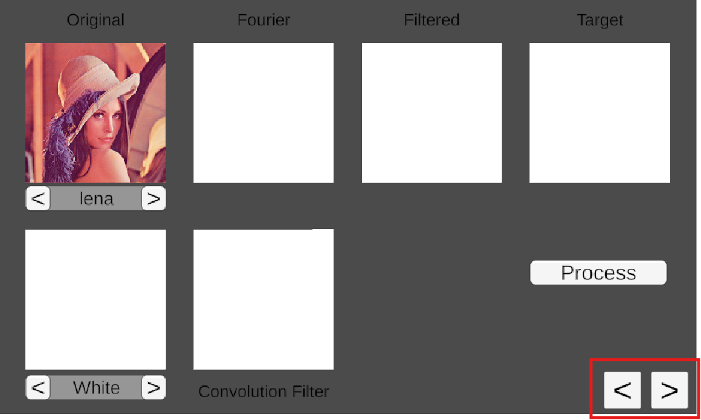
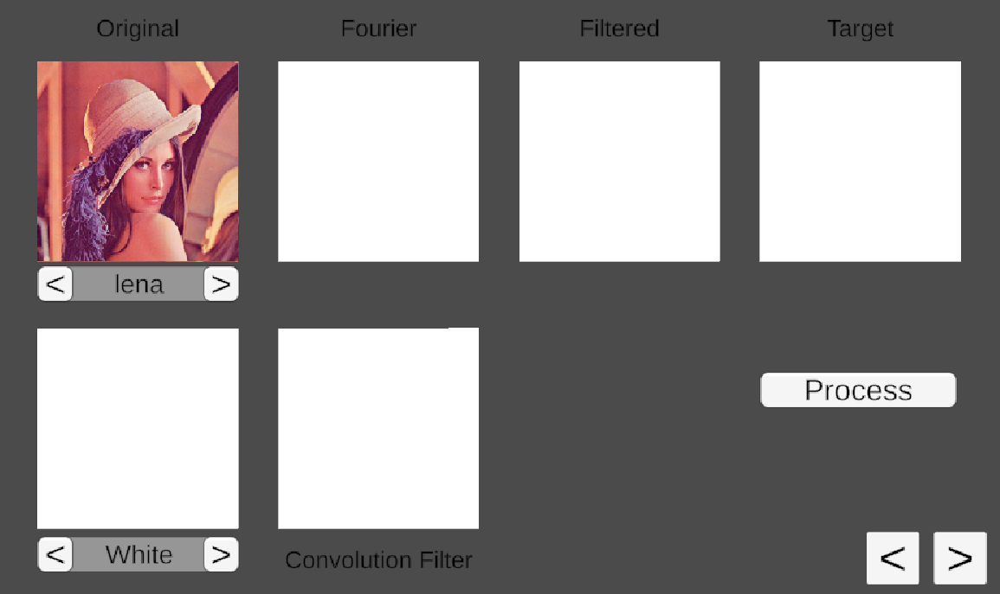
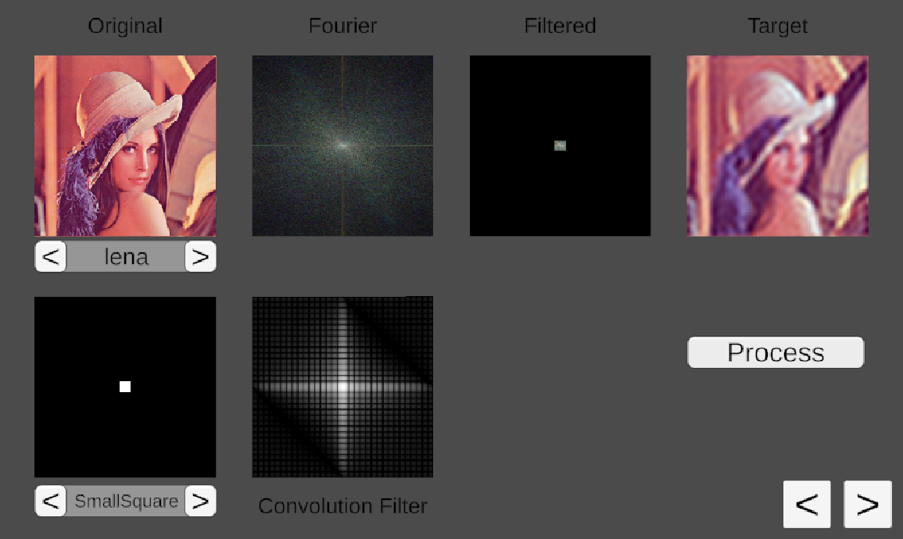
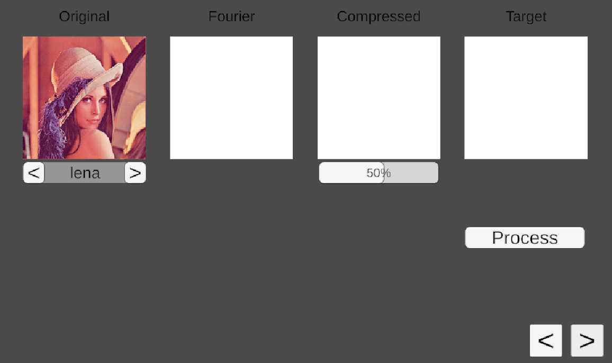
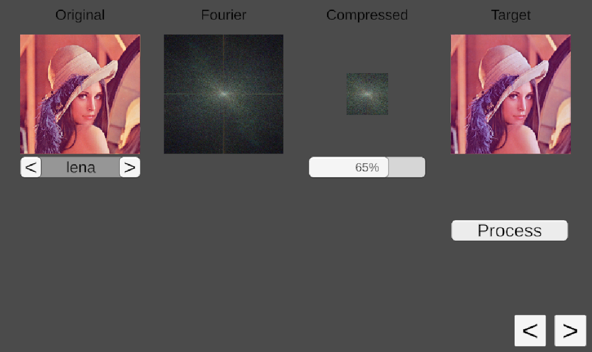

# *Fast Fourier Transform* - **Unity C#**
### ISART DIGITAL MGP2, School Project: *Guillaume CHICLET, Rémi GINER, Lancelot MARÉCHAL*  

# About The Project 
This project is an implementation of the fast fourier transform in 2D. It is an attempt to make a image compressor.

# Table of contents
1. [Content](#content)
    - [Filtering](#filtering)
    - [Compression](#compression)
2. [References](#references)
3. [Credits](#credits)

# Content
Implementation of the FFT in 2D.  
The SampleScene provides demos for its use on images.  

There are two demos, one with image filtering and one with image compression.

## Filtering
This uses a black & white filter applied to the transformed image.

You can select the image on the top left (**Original**). You can also select a filter on the bottom left. Then click on the "Process" button.

* **Fourier**: transformed image/spectrum
* **Filtered**: transformed image/spectrum with filter
* **Target**: inverse of the filtered image (original with filter)
* **Convolution Filter**: transformed filter

## Compression
This uses a compression percentage to reduce the transformed image/spectrum size.

You can select the image on the top left (**Original**). You can change the compression percentage (under **Compressed** image). Then click on the "Process" button.

* **Fourier**: transformed image/spectrum
* **Compressed**: transformed image/spectrum compressed
* **Target**: inverse of the compressed image (original with compression)

## References:
- https://github.com/Frederoche/Fourier-transform
- https://www.youtube.com/watch?v=spUNpyF58BY  
- https://www.youtube.com/watch?v=r6sGWTCMz2k  
- https://www.youtube.com/watch?v=3gAZ0U66AEA
- https://www.youtube.com/watch?v=Iz6C1ny-F2Q&t=497s
- https://www.youtube.com/watch?v=oACegp4iGi0

## Credits
* Guillaume CHICLET
* Rémi GINER
* Lancelot MARÉCHAL